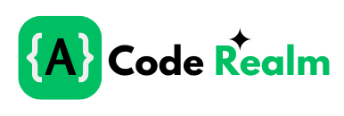
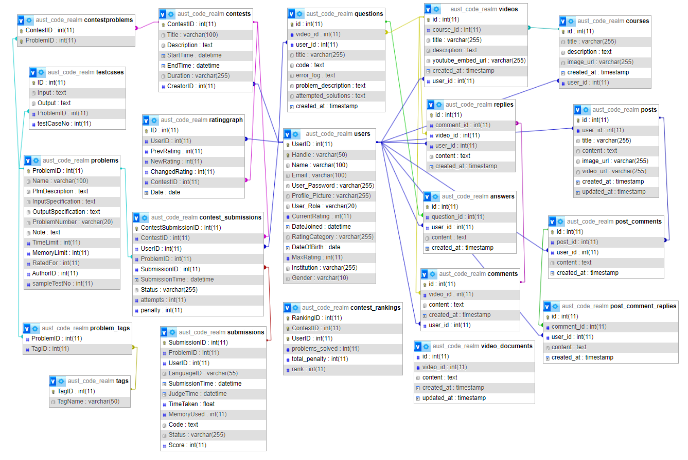

<div align="center">
  
  <h1><strong>AUST CODE REALM</strong></h1>
  <p>Empowering Programmers Through Competitions, Learning, and Community</p>

  <p>
      <a href="https://github.com/AfnanRakib/AUST-CODE-REALM/graphs/contributors">
        
      </a>
      <a href="https://github.com/AfnanRakib/AUST-CODE-REALM/commits/main">
        
      </a>
      <a href="https://github.com/AfnanRakib/AUST-CODE-REALM/issues">
        
      </a>
      <a href="https://github.com/AfnanRakib/AUST-CODE-REALM/stargazers">
        
      </a>
    </p>
  </div>
  
  
  ## 📚 Table of Contents
  
  - [📋 Project Description](#-project-description)
  - [🎯 Key Features](#-key-features)
  - [🛠️ Technologies Used](#-technologies-used)
  - [🏗️ System Architecture](#-system-architecture)
  - [🗃️ Database Schema](#️-database-schema)
  - [🚀 Getting Started](#-getting-started)
  - [🎥 Live Demo](#-live-demo)
  - [👨‍💻 Team](#-team)
  - [💬 Feedback](#-feedback)
  


## 📋 Project Description

**AUST CODE REALM** is an advanced web-based online judge platform designed to facilitate coding competitions, problem-solving practice, and performance evaluation. The platform serves as a comprehensive tool for competitive programming enthusiasts, educational institutions, and coding communities.
By providing a seamless interface for hosting contests, solving problems, and tracking user performance through a robust rating system, the website ensures a smooth and engaging experience for all users.

## 🎯 Key Features

- **Online Judge System** - Submit and evaluate code against test cases
- **Problem Archive** - Comprehensive collection of coding challenges
- **Contest Hosting** - Create and participate in competitive programming contests
- **Integrated Learning Platform** - Structured courses for programming skill development
- **Responsive IDE** - Code directly in the browser with syntax highlighting
- **User Rating System** - Track competitive progress and skill development
- **Community Engagement** - Connect with AUST's competitive programming community

## 🛠️ Technologies Used

<div align="center">
  
  
  
  
  
  
</div>

## 🏗️ System Architecture

Our platform follows a structured architecture to provide a seamless user experience:

1. **Frontend Layer**
   - HTML5 & CSS3 for UI components
   - JavaScript for interactive elements

2. **Backend Layer**
   - PHP for server-side processing
   - MySQL database for data storage
   - Judge0 api code evaluation
   - Ace editor for integrated ide
   - Richtext for integrated editor

3. **Development Environment**
   - Visual Studio Code for code editing
   - XAMPP for local development and testing


## 🗃️ Database Schema

The ERD below illustrates the structure of the database used in **AUST CODE REALM**.

<div align="center">
  
</div>


## 🚀 Getting Started

### Prerequisites

To run AUST CODE REALM locally, make sure you have:

* PHP >= 7.4
* MySQL Server
* XAMPP
* Visual Studio Code (or any IDE)

### Installation

1. Clone the repo:

```bash
git clone https://github.com/AfnanRakib/AUST-CODE-REALM.git
```

2. Move the project to your XAMPP `htdocs` folder:

```bash
mv AUST-CODE-REALM /path-to-xampp/htdocs/
```

3. Import the `aust_code_realm.sql` file into phpMyAdmin.

4. Start Apache and MySQL via XAMPP.

5. Visit `http://localhost/AUST-CODE-REALM/` in your browser.


## 🎥 Live Demo

* 🌐 [Live Website](http://acr.rf.gd/)

* 🎦 [Demo Video](https://www.youtube.com/watch?v=your-demo-video)


## 👨‍💻 Team

| Name                        | LinkedIn                                                               |
| --------------------------- | ---------------------------------------------------------------------- |
| Md. Rakib Hasan             | [Profile](https://www.linkedin.com/in/afnanhasanrakib)                 |
| Md. Shahriar Rahman Bhuyian | [Profile](https://www.linkedin.com/in/shahriar-rahman-3893012a8/)      |
| Kazi Zannatul Tajrin        | [Profile](https://www.linkedin.com/in/kazi-zannatul-tajrin-76b835256/) |


## 💬 Feedback

If you have any feedback, suggestions, or want to collaborate — feel free to [open an issue](https://github.com/AfnanRakib/AUST-CODE-REALM/issues) or reach out via Linkedin.
